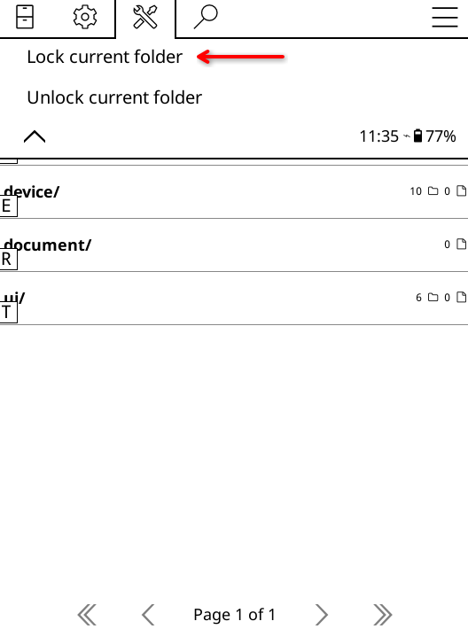
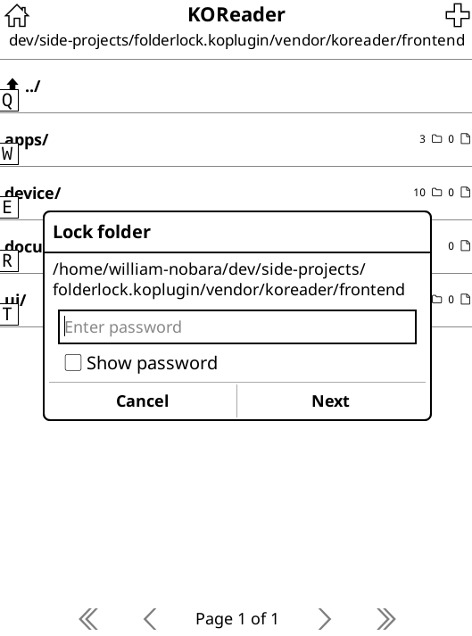
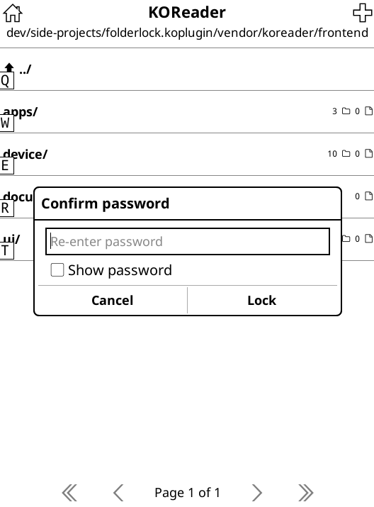
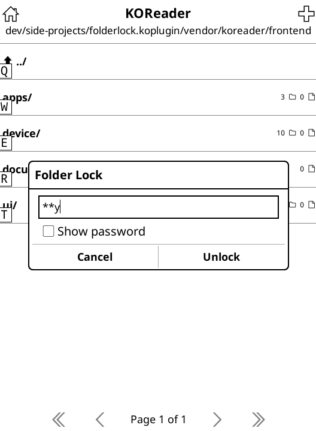
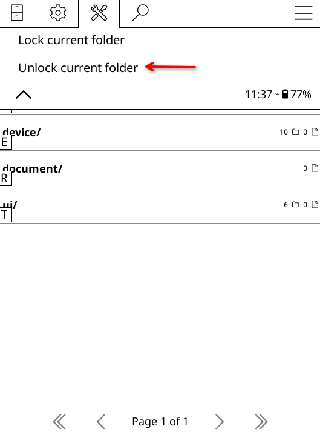

# folderlock.koplugin

## Overview

`folderlock.koplugin` adds password protection to folders in KOReader's File Manager, so locked folders ask for a password before they can be opened.

## Demo / Screenshot

*Screenshots of the full workflow are in the [Usage](#usage) section below.*

## Philosophy & Scope

folderlock.koplugin is designed to be a privacy barrier, not a software fortress. Its primary goal is to keep casual snoopers (friends, family, or kids) out of specific folders with zero configuration overhead, while ensuring your library remains fundamentally safe.

**Intuitively Native:** No complex dashboards. It integrates seamlessly into KOReader's existing long-press menus and standard keyboard prompts.

**Fail-Safe Security:** Your files are never encrypted or modified. This eliminates any risk of file corruption or permanent lockouts if the plugin is uninstalled or encounters an error.

**Invisible Performance:** Completely event-driven. It uses lightweight path-matching logic that won't drain your e-reader's battery or slow down navigation.

⚠️ **Note on Security:** This is an application-level UI lock. It blocks access entirely within KOReader, but files will still be visible normally if you connect your e-reader to a computer via USB.

## Features

- Lock any folder directly from KOReader's menu
- Unlock a folder from the same menu
- Password prompt when opening locked folders
- Parent locks cascade to subfolders automatically

## Installation

> 📝 **Draft** — review welcome. Let me know if anything should change.

1. Download the latest `folderlock.koplugin-*.zip` from the [Releases](https://github.com/williambnobara/folderlock.koplugin/releases) page.
2. Extract the archive.
3. Copy the `folderlock.koplugin/` folder into your KOReader `plugins/` directory.
4. Restart KOReader.

## Usage

1. Open KOReader's File Manager and navigate to the folder you want to protect.
2. Open the menu, go to **Folder Lock** and select **Lock current folder**.

   

3. Enter a password, then confirm it.

   
   
   

4. Try opening the locked folder — a password prompt will appear. Enter the correct password to proceed.

   

5. To remove the lock permanently, go to **Folder Lock** > **Unlock current folder** and enter your current password.

   

## Upcoming Features

These capabilities are planned for future releases:

**Automatic Updater** — One-tap update button inside KOReader so users stay current without manual reinstalls. The changelog is shown automatically before applying updates.

**File-Based Lock** — Prevents access to locked files through History, Recent, or Favorites entries. A locked placeholder image or cover is shown until the folder is unlocked.

**Cover Cache Isolation** — Prevents other plugins from caching cover images or metadata from locked folders, eliminating information leaks.

## License

This project is licensed under the GNU Affero General Public License v3.0. See the [LICENSE](LICENSE) file for details.
