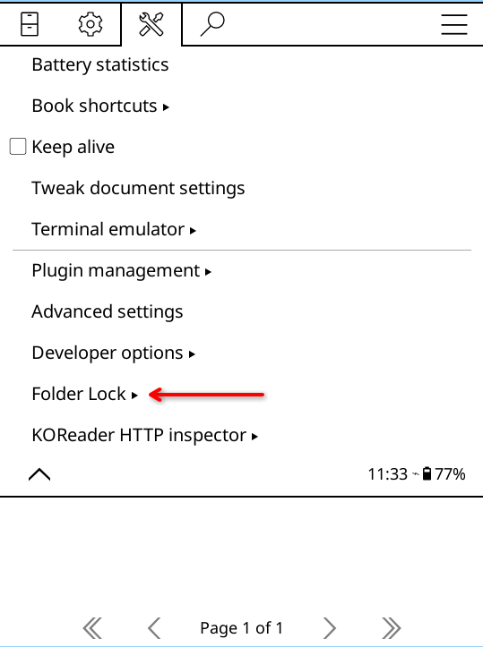
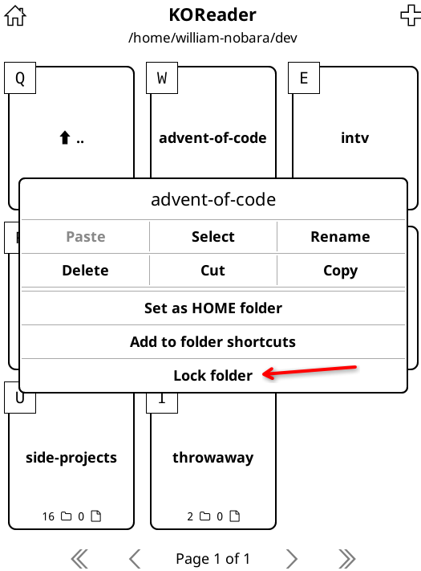
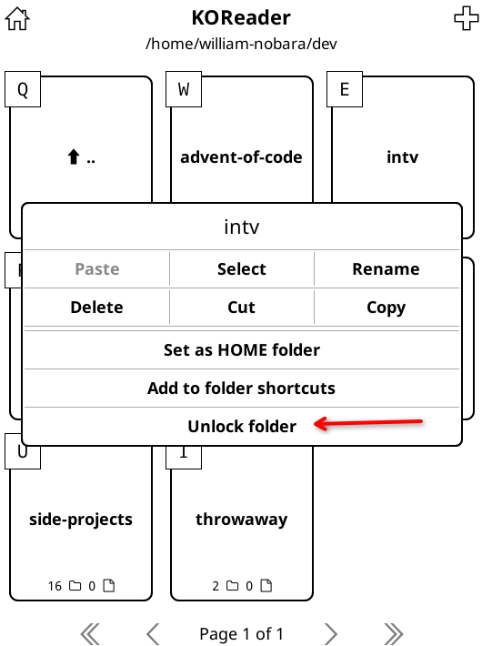

# folderlock.koplugin

## Overview

`folderlock.koplugin` adds password protection to folders in KOReader's File Manager, so locked folders ask for a password before they can be opened.

## Demo / Screenshot

*Screenshots of the full workflow are in the [Usage](#usage) section below.*

## Philosophy & Scope

folderlock.koplugin is designed to be a privacy barrier, not a software fortress. Its primary goal is to keep casual snoopers (friends, family, or kids) out of specific folders with zero configuration overhead, while ensuring your library remains fundamentally safe.

**Intuitively Native:** No complex dashboards. It integrates seamlessly into KOReader's existing long-press menus and standard keyboard prompts.

**Fail-Safe Security:** Your files are never encrypted or modified. This eliminates any risk of file corruption or permanent lockouts if the plugin is uninstalled or encounters an error.

**Invisible Performance:** Completely event-driven. It uses lightweight path-matching logic that won't drain your e-reader's battery or slow down navigation.

⚠️ **Note on Security:** This is an application-level UI lock. It blocks access entirely within KOReader, but files will still be visible normally if you connect your e-reader to a computer via USB.

## Features

- Lock any folder directly from FileManager's long-press context menu
- Remove a folder lock from the same long-press menu
- Password prompt when opening locked folders
- Parent locks cascade to subfolders automatically
- **Auto-update** — check for and install new versions from inside KOReader (**Folder Lock → Check for updates**)
- **File-level access protection** — opening a book that lives inside a locked folder from History, Collections, File Search, or another folder prompts for the folder password before the book opens.

## Installation

> 📝 **Draft** — review welcome. Let me know if anything should change.

1. Download the latest `folderlock.koplugin-*.zip` from the [Releases](https://github.com/William9923/folderlock.koplugin/releases) page.
2. Extract the archive.
3. Copy the `folderlock.koplugin/` folder into your KOReader `plugins/` directory.
4. Restart KOReader.

### Updating

Once installed, you can update from inside KOReader:

1. Open the menu → **Folder Lock** → **Check for updates**.
2. If a new version is available, confirm the install.
3. Restart KOReader when prompted.

## Usage

### Locking/Unlocking a folder

Lock or unlock a folder directly from FileManager's long-press menu:

1. In FileManager, long-press a folder.
2. Tap **Lock folder** (if the folder is unlocked) or **Remove Lock** (if the folder is locked).

   
   

3. Enter your password and confirm (lock) or enter your password (unlock).

Parent locks cascade to subfolders automatically. To open a subfolder of a locked parent, enter the parent's password; the subfolder itself is not locked unless you lock it separately.

### Accessing locked files from History, Collections, or Search

Books inside a locked folder remain protected even when they appear in other places:

1. Open **History**, a **Collection**, or **File Search**.
2. Tap a book that is stored inside a locked folder.
3. Enter the password for the folder that contains the book.
4. The book opens after the password is accepted.

If you cancel the password prompt, the book does not open.

## Upcoming Features

1. Manage all folder locks from the main Folder Lock menu
2. Integration with other KOReader plugins

## License

This project is licensed under the GNU Affero General Public License v3.0. See the [LICENSE](LICENSE) file for details.
